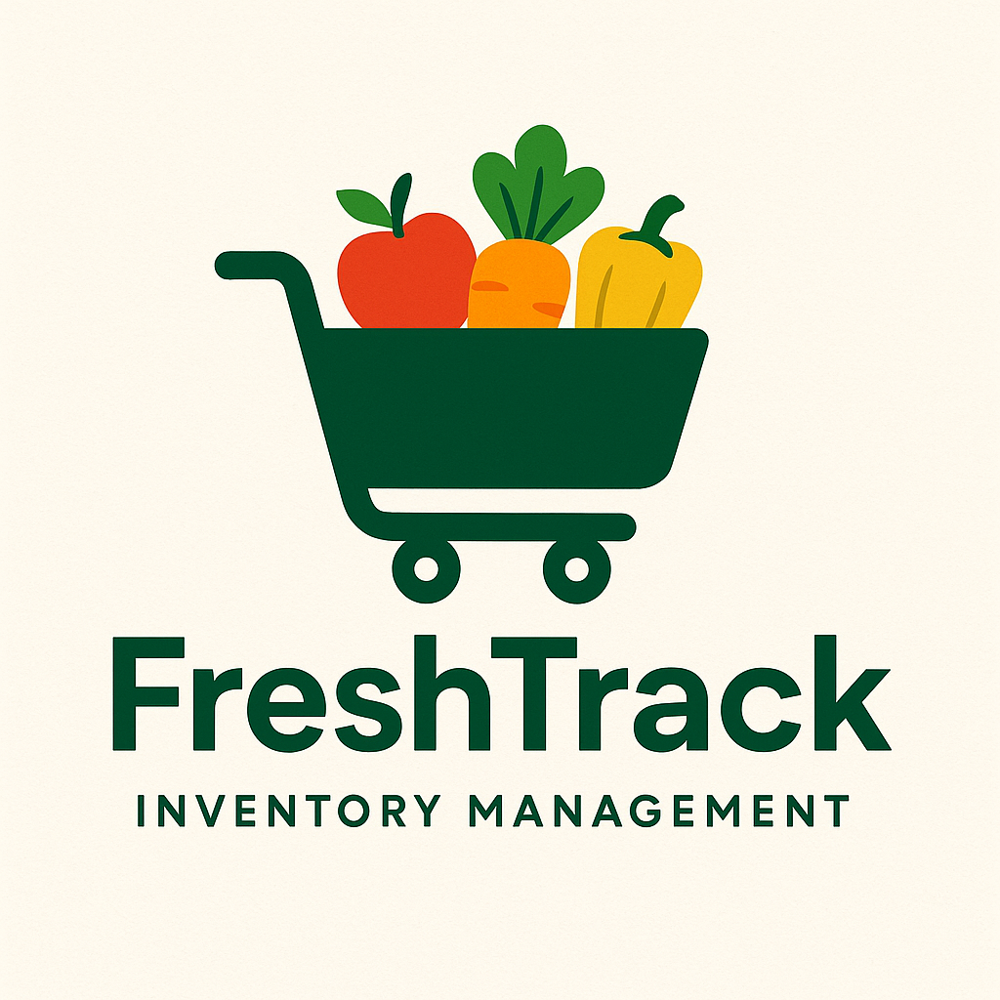

# FreshTrack

## Getting Stared

- [FreshTrack](https://pc-freshtrack-07ad6ebbc1cb.herokuapp.com/)
- [FreshTrack Repo]()
- [Planning Materials](https://trello.com/b/7gbw3HeV/freshtrack)

## About the App

FreshTrack is designed to make inventory management effortless. With a clean, intuitive interface, it takes the complexity out of tracking groceries and supplies so you can stay organized without extra hassle. Whether you’re managing a pantry, small business, or personal stock, FreshTrack keeps everything simple, reliable, and efficient.

## Attributions

- Logo generated with ChatGPT
- [Claude for debugging](https://claude.ai/new)
- [W3Schools for CSS](https://www.w3schools.com/)
- [Django Documentation](https://www.djangoproject.com/)

## Technology Used

- Django
- Python
- AWS
- Heroku

## Next Steps

Features I would like to add include but are not limited to;
- Detailed stock quantity (amount on shelves, in storage, being purchased, etc.)
- Cost per purchase and retail price
- Alerts
- Data Analytics and Visualization of product data (which products are selling fast, products with the highest profit margin, etc.)
- [API integration with Open Food Facts](https://world.openfoodfacts.org/data)
- Table customization (disabling columns)